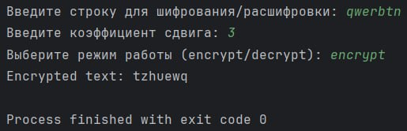

# Исполнитель
Галай Анатолий Фт-320007

# Краткое описание
Этот код реализует простую схему шифрования и дешифрования текста с использованием сдвига символов (аналогично шифру Цезаря). Пользователь вводит строку, коэффициент сдвига и выбирает режим работы (шифрование или дешифрование). В зависимости от выбранного режима, код либо шифрует, либо дешифрует введенный текст, сдвигая каждый символ на заданное количество позиций в Unicode таблице.

# Среда программирования, язык
PyCharm Community Edition 2024.1.1 ; Python

# Тест

